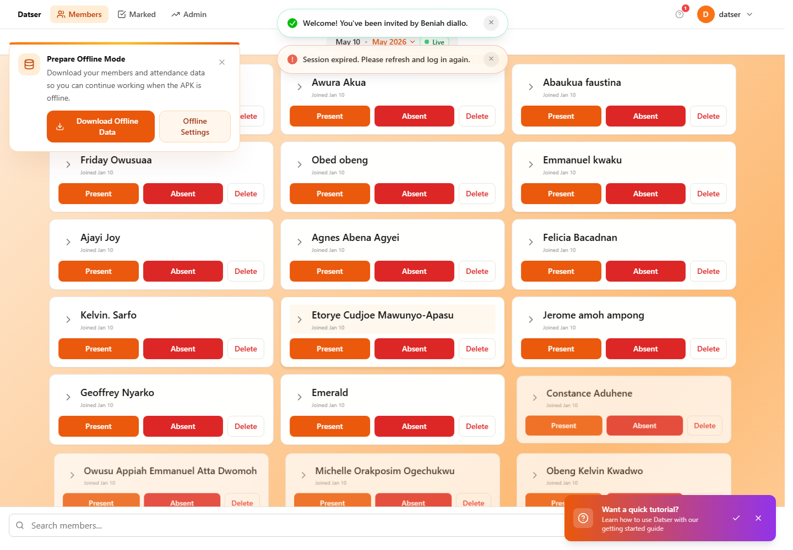

# DatSer

DatSer is a React + Vite attendance and member-management dashboard backed by Supabase. It is built for ministry teams that need fast Sunday attendance marking, searchable member records, collaborator access, analytics, CSV exports, offline-ready Android use, and private APK update management.



## What DatSer Does

- **Attendance tracking**: Mark members present or absent for the selected service date, switch between month tables, and review marked attendance quickly.
- **Member management**: Search members, add or edit profiles, manage badges, filter by profile details, and load large member lists without blocking the UI.
- **Missing-data protection**: Prompt admins to complete important member details before saving attendance when required.
- **Analytics and exports**: Review attendance trends and export monthly data to CSV.
- **Collaborator workspaces**: Invite collaborators and keep them aligned with the workspace owner while preserving Supabase access boundaries.
- **Offline mode**: Prepare local member and attendance data, keep working in the Android APK or mobile webview while offline, queue attendance changes, and sync them when online again.
- **Private Android updates**: Manage APK releases from the admin area with Supabase-backed release metadata, force-update support, and a fallback version file.
- **Accessibility and preferences**: Sync theme, font size, font family, and OpenDyslexic settings across devices.

## Tech Stack

- **Frontend**: React 18, Vite, Capacitor
- **Styling**: Tailwind CSS, PostCSS, custom responsive UI
- **Backend**: Supabase Auth, PostgreSQL, Realtime, Storage, RLS
- **State**: React Context (`AppContext`, `AuthContext`, `ThemeContext`)
- **Testing**: Vitest, Playwright smoke tests
- **Icons**: Lucide React

## Getting Started

Install dependencies:

```bash
npm install
```

Run the local website:

```bash
npm run dev
```

Build for production:

```bash
npm run build
```

Preview the production build:

```bash
npm run preview
```

## Environment Variables

Create `.env` or `.env.local` in the project root:

```bash
VITE_SUPABASE_URL=https://your-project.supabase.co
VITE_SUPABASE_ANON_KEY=your-anon-key
VITE_SUPABASE_REDIRECT_URL=http://localhost:5173
```

Do not commit private passwords, service-role keys, signing keys, or personal login details. The frontend anon key is expected to be protected by Supabase Row Level Security.

## Supabase Requirements

DatSer expects Supabase tables, RPCs, storage policies, and RLS rules for the attendance app. Important pieces include:

- Monthly attendance/member tables such as `January_2026`
- `user_preferences` for theme, font, selected month, and workspace settings
- `collaborators` for invite and workspace access
- `app_releases` plus the `app-updates` storage bucket for private APK updates
- RPC helpers such as `get_owner_workspace_name(owner_uuid)` and `get_table_columns(table_name)`

Run the migrations in `supabase/migrations/` before using all production features.

## Offline Mode

Offline mode is designed for previously authenticated users and cached workspace data. From Settings, use `Download Offline Data` while online to save members, month metadata, selected date, and attendance data locally. Offline attendance changes are queued in IndexedDB and synced later with conflict checks instead of blindly overwriting server data.

More details are in [OFFLINE_MODE.md](OFFLINE_MODE.md).

## Android APK

The Capacitor Android app can either load the live website or bundle the current local build:

```bash
npm run android:apk
npm run android:apk:local
```

The Android package name is `com.datser.app`. Keep the same package name and signing key for future updates.

More details are in [ANDROID_APK.md](ANDROID_APK.md) and [APP_UPDATES.md](APP_UPDATES.md).

## Verification

Use these checks before shipping changes:

```bash
npm test
npm run lint
npm run build
npm run test:smoke
npm run test:smoke:prod
```

For local Android QA:

```bash
npm run android:apk:local
```

Debug APK output:

```text
android\app\build\outputs\apk\debug\app-debug.apk
```

## Deployment

Deploy the Vite build to Vercel or another static host, set the Supabase environment variables in the host settings, and confirm the production bundle with `npm run test:smoke:prod`. The Android live-wrapper APK points at the deployed DatSer website, while local bundled APKs use the current `dist` output.

## Security

Supabase RLS is the security boundary. Users should only see data they own or have explicitly been granted through collaborator access. Offline mode must remain scoped to the authenticated/cached workspace user and should not weaken online permissions.

## License

Proprietary. All rights reserved.
